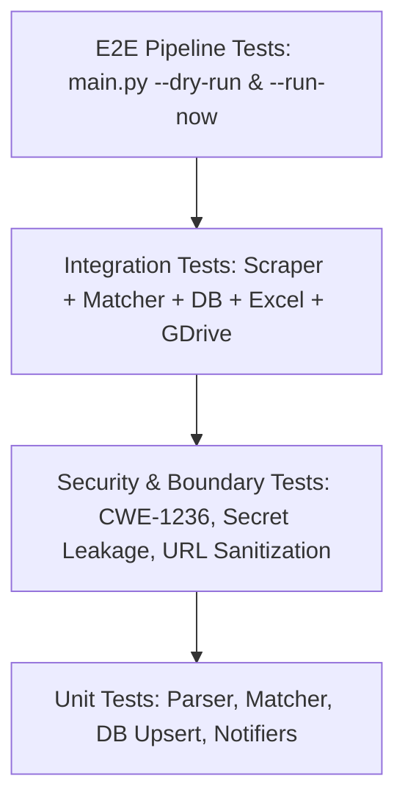

# 🧪 End-to-End QA Testing Strategy & Test Plan
**Project:** Automated Daily AI Job Hunting Agent  
**Role:** Senior QA Automation Engineer  
**Version:** 2.0  
**Coverage Target:** ≥ 90% Unit, Integration & E2E Test Coverage  

---

## 1. Executive Summary & Quality Objectives

The **Daily AI Job Hunter** is an autonomous, mission-critical application handling data ingestion, NLP resume matching, database persistence, Excel generation, and multi-channel notifications.

### Core Quality Goals:
1. **Zero False Positives in Seniority Filtering**: Ensure candidates (0–2 years) are never matched with Lead/Staff/Principal roles.
2. **Data Integrity & Zero Duplication**: Ensure SHA-256 job hashing prevents duplicate entries in SQLite / PostgreSQL.
3. **Security & Injection Immunity (CWE-1236)**: Prevent CSV/Excel formula injection and malicious URL scheme execution (`javascript:`, `file:///`, `data:`).
4. **Network & Fault Resilience**: Ensure the scraper automatically retries and recovers from transient DNS (`[Errno 11001]`), HTTP 429, 500, 502, 503, 504 errors without crashing the daily job pipeline.
5. **Multi-Channel Dispatch Verification**: Guarantee that failure of one notifier (e.g. WhatsApp) does not block Email, Google Drive, or Telegram dispatches.

---

## 2. Test Architecture & PyTest Test Pyramid



---

## 3. End-to-End Test Matrix & Traceability

| Test ID | Module | Scenario / Objective | Expected Result | Priority |
|---|---|---|---|---|
| **TC-001** | `core.resume_parser` | Parse valid PDF resume (`.pdf`) | Extract text, skills list, target roles, and education | **P0** |
| **TC-002** | `core.resume_parser` | Parse Markdown resume (`.md`) | Extract structured profile dictionary | **P1** |
| **TC-003** | `core.resume_parser` | Nonexistent or corrupt file path | Return safe fallback dictionary with 0 unhandled crashes | **P0** |
| **TC-004** | `core.job_scraper` | Apify Indeed India Actor query | Ingest structured jobs with company, role, salary, location | **P0** |
| **TC-005** | `core.job_scraper` | Apify Google Search multi-board discovery | Classify tags (`Naukri`, `LinkedIn`, `Internshala`, etc.) | **P0** |
| **TC-006** | `core.job_scraper` | Free Tech APIs (WWR, RemoteOK, Remotive, Himalayas) | Fallback ingestion yields ≥20 jobs without Apify token | **P1** |
| **TC-007** | `core.job_scraper` | Transient DNS failure / HTTP timeout | HTTPAdapter retries 3x with backoff and resumes cleanly | **P0** |
| **TC-008** | `core.matcher` | Senior / Lead / Principal role filtering | Score capped at ≤30.0% (disqualified from final report) | **P0** |
| **TC-009** | `core.matcher` | Skill synergy & fresher keyword scoring | High overlap roles score ≥85.0% (highlighted green) | **P0** |
| **TC-010** | `core.matcher` | Automatic fallback on malformed input | Gracefully invoke `_baseline_evaluate_job` with 0 crashes | **P1** |
| **TC-011** | `core.db` | First-time job insertion (SQLite) | Status set to `🆕 NEW` | **P0** |
| **TC-012** | `core.db` | Re-discovering identical job next day | Status set to `⏳ STILL OPEN` without duplicating rows | **P0** |
| **TC-013** | `core.db` | Re-discovering job with modified salary/URL | Status updated to `🔄 UPDATED` | **P1** |
| **TC-014** | `core.db` | Cloud PostgreSQL / Supabase connection | Automatic schema creation and parameterized query binding | **P1** |
| **TC-015** | `core.excel_generator` | Build 6-sheet workbook (`.xlsx`) | Generate sheets: `DAILY JOBS`, `TOP MATCHES`, `REMOTE`, `AI & GENAI`, `INTERNSHIPS`, `TESTING & ANALYST` | **P0** |
| **TC-016** | `core.excel_generator` | 1-Click Referral column generation | Column 13 populated with valid encoded LinkedIn URL (`Ask Referral ↗`) | **P0** |
| **TC-017** | `core.excel_generator` | Formula Injection Defense (CWE-1236) | Strings starting with `=`, `+`, `-`, `@`, `\t` prepended with `'` | **P0** |
| **TC-018** | `core.excel_generator` | Malicious URL sanitization | Non-http protocols (`javascript:`, `file:`) neutralized to `N/A` | **P0** |
| **TC-019** | `notifiers.gdrive_uploader`| Upload via OAuth2 Desktop credentials | Report uploaded directly to target folder ID | **P0** |
| **TC-020** | `notifiers.gdrive_uploader`| Local cloud folder sync fallback | File copied to `GDRIVE_LOCAL_PATH` | **P1** |
| **TC-021** | `notifiers.email_notifier` | Brevo SMTP / Gmail SSL dispatch | HTML digest + `.xlsx` attachment delivered | **P0** |
| **TC-022** | `notifiers.telegram_notifier`| Telegram Bot notification | Summary message + `.xlsx` document sent to Chat ID | **P1** |
| **TC-023** | `notifiers.ntfy_notifier` | Ntfy.sh push notification | Mobile push notification dispatched with file URL | **P1** |
| **TC-024** | `security.secrets` | Git repository leak prevention | `.gitignore` covers `.env`, `*.db`, `*.xlsx`, `resume/*.pdf`, `config/token.json` | **P0** |
| **TC-025** | `main` | Dry run CLI flag (`--dry-run`) | Scrapes, scores, builds Excel, but skips notification dispatches | **P0** |
| **TC-026** | `main` | Schedule Daemon CLI flag (`--schedule`)| Scheduler wakes up daily at `DAILY_RUN_TIME` | **P1** |

---

## 4. Security & Vulnerability Test Suite (Penetration Verification)

### A. Spreadsheet Formula Injection (CSV / Excel Injection - CWE-1236)
* **Attack Payload**:
  ```python
  payloads = [
      "=cmd|' /C calc'!A0",
      "+2+5+cmd|' /C notepad'!A0",
      "@SUM(1+1)*cmd|' /C whoami'!A0",
      "-1000%2Bcmd|' /C powershell'!A0",
      "\t=SUM(A1:A10)",
      "\r=1+1"
  ]
  ```
* **Validation Criteria**: The cell value must be prepended with a single quote `'` so Microsoft Excel and LibreOffice Calc render it as plain text rather than executing dynamic formula commands.

### B. Malicious Hyperlink Protocols
* **Attack Payload**:
  ```python
  malicious_urls = [
      "javascript:alert(document.cookie)",
      "file:///C:/Windows/System32/cmd.exe",
      "data:text/html,<script>alert(1)</script>"
  ]
  ```
* **Validation Criteria**: The hyperlink attribute must be discarded, and the cell value neutralized to `"N/A"`.

---

## 5. Automated E2E Test Execution Guide

### 1. Run Complete PyTest Suite with Verbose Output
```powershell
python -m pytest -v
```

### 2. Run Test Coverage Analysis
```powershell
pip install pytest-cov
python -m pytest --cov=core --cov=notifiers --cov=config tests/
```

### 3. Execute Smoke Test Pipeline
```powershell
# Fast Dry Run (validates parser, scrapers, matcher, and Excel generation in <30s)
python main.py --dry-run
```

### 4. Execute Full Live Pipeline Test
```powershell
# Live Run (validates Google Drive upload & Brevo Email delivery)
python main.py --run-now
```

---

## 6. CI/CD Quality Gates (GitHub Actions)

Every pull request or scheduled commit to `main` must pass the automated GitHub Actions quality gate:
1. **Lint & Type Check**: Zero syntax or import errors (`python -m py_compile`).
2. **Security Gate**: 100% pass on `test_security.py` (Zero secret leakage, CWE-1236 defense verified).
3. **Execution Gate**: Full pipeline exit code must strictly be `0`.
