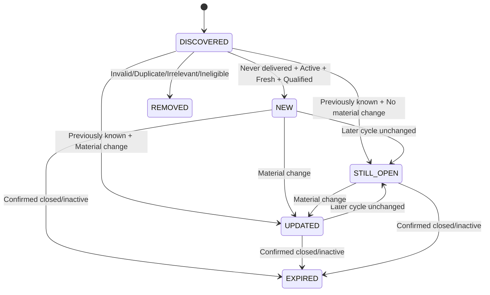

# 🚀 AI JOB HUNTING AGENT — END-TO-END AUTOMATION WORKFLOW SPECIFICATION

**Document Version:** `2.0.0-PROD-CORRECTED`  
**System Name:** Automated Daily AI Job Hunter & Recruiter Engine  
**Candidate Profile:** Srinivas A (B.E. Information Science, Bengaluru)  
**Execution Environment:** Autonomous Cloud (GitHub Actions + cron-job.org) & Local Windows

> **V2 purpose:** Preserve the existing working architecture, sources, scoring, Excel, Drive, email, history, and automation design while correcting the weaknesses in V1: semantic cross-board deduplication, true NEW-vs-freshness logic, evidence-based source coverage, qualification-vs-freshness scoring, job verification, recruiter-link labeling, private Drive storage, consistent 20–30 output targets, and evidence-based audit status.

---

## 1. SYSTEM OVERVIEW

The **AI Job Hunting Agent** is a self-hosted recruitment intelligence pipeline designed to reduce manual job searching.

The pipeline:

1. Loads the structured candidate profile/resume.
2. Builds personalized search criteria.
3. Searches multiple job boards, remote feeds, developer communities, and company ATS portals.
4. Normalizes all discovered listings into one canonical job record.
5. Verifies freshness, application availability, location, experience, and active hiring evidence.
6. Performs semantic duplicate detection across different sources.
7. Scores relevance against the candidate profile.
8. Compares the current run with persistent history.
9. Classifies opportunities as `NEW`, `UPDATED`, `STILL_OPEN`, `EXPIRED/CLOSED`, or `REMOVED`.
10. Produces a 6-sheet Excel report.
11. Stores reports and history.
12. Delivers the daily report by email and/or configured notification channels.
13. Records objective evidence and execution metrics.

### Core integrity principle

The system must **never claim that a feature is operational merely because the specification contains the feature**.

Operational status must be based on execution evidence such as:

- successful run logs,
- source-level retrieval counts,
- verification results,
- generated files,
- database state,
- notification delivery evidence,
- automated workflow run history,
- test results.

---

## 2. CORE OBJECTIVE

### Primary objective

Discover, verify, score, rank, and deliver approximately **20–30 genuinely relevant NEW job opportunities per daily cycle**.

### Quality-over-quantity rule

If only 14 qualifying NEW jobs exist, return **14**.

If only 7 qualify, return **7**.

Never manufacture, duplicate, recycle, or pad results to reach 20–30.

### A job qualifies for the daily NEW report only when:

- the role is relevant to the candidate,
- the experience level is realistically eligible,
- the posting is sufficiently fresh according to configured freshness rules,
- the job has not previously been delivered as NEW,
- the listing is still active or has credible active-hiring evidence,
- an application URL is available,
- location/work-mode information is usable,
- the listing passes duplicate and quality checks,
- the match score meets the configured threshold.

---

## 3. CANDIDATE PROFILE — SOURCE OF TRUTH

```json
{
  "candidate_profile": {
    "name": "Srinivas A",
    "email": "anandsrinivas98@gmail.com",
    "links": {
      "linkedin": "https://linkedin.com/in/srinivasa98",
      "github": "https://github.com/anandsrinivas98"
    },
    "education": {
      "degree": "B.E. in Information Science and Engineering",
      "institution": "Sri Sairam College of Engineering, Bengaluru",
      "cgpa": 7.9,
      "cohort": "2023 - Present (Final Year / Fresher Entry)"
    },
    "commercial_experience": {
      "role": "Full Stack Intern",
      "company": "Surviva Technologies",
      "duration": "Jul 2025 - Sep 2025",
      "highlights": [
        "Unit testing (PyTest)",
        "SaaS frontend development",
        "REST API integration"
      ]
    },
    "technical_competencies": {
      "languages": ["Python", "JavaScript", "TypeScript", "SQL"],
      "backend_api": [
        "FastAPI",
        "Node.js",
        "Express",
        "Flask",
        "SQLAlchemy",
        "REST APIs",
        "Microservices"
      ],
      "frontend": [
        "React",
        "Next.js 14",
        "Tailwind CSS",
        "Framer Motion",
        "HTML5",
        "CSS3"
      ],
      "ai_ml_genai": [
        "LangChain",
        "RAG",
        "HuggingFace",
        "TensorFlow",
        "Scikit-learn",
        "Prompt Engineering",
        "spaCy",
        "NLTK"
      ],
      "databases": [
        "PostgreSQL",
        "MySQL",
        "SQLite",
        "Supabase",
        "NeonDB"
      ],
      "devops_testing": [
        "Docker",
        "Docker Compose",
        "Git",
        "GitHub",
        "Linux",
        "PyTest",
        "CI/CD"
      ]
    }
  }
}
```

The candidate profile remains the source of truth. The system must not invent skills, certifications, experience, employers, or qualifications.

---

## 4. SEARCH CONFIGURATION & TARGET ROLES

### Software Development

Software Engineer, Software Developer, SDE, SDE-1, Associate Software Engineer, GET, Junior Software Engineer, Backend Developer, Frontend Developer, Full Stack Developer, Python Developer, React Developer, React Native Developer, API Developer, Application Developer, Web Developer, Junior Developer, Software Trainee, Technology Associate, Technical Associate, Engineering Associate.

### AI / ML / GenAI

AI Engineer, AI/ML Engineer, Machine Learning Engineer, AI Developer, AI Intern, ML Intern, Generative AI Engineer, GenAI Engineer, GenAI Intern, LLM Engineer, LLM Intern, RAG Engineer, RAG Intern, NLP Engineer, NLP Intern, Computer Vision Engineer, AI Research Intern, Applied AI Engineer, Applied ML Engineer, Junior AI Engineer, Junior ML Engineer.

### Testing / QA / SDET

Software Tester, Test Engineer, QA Engineer, Quality Analyst, QA Analyst, Manual Tester, Automation Tester, QA Automation Engineer, SDET, Junior SDET, QA Intern, Software Testing Intern, API Tester, Functional Tester, Web Application Tester, Test Automation Engineer, Junior QA, Associate QA Engineer.

### Data / Business / Technology Analyst

Data Analyst, Junior Data Analyst, Business Analyst, Junior Business Analyst, Technology Analyst, IT Analyst, Systems Analyst, Data Operations Analyst, Reporting Analyst, Operations Analyst, Product Analyst, BI Analyst, Data Quality Analyst, Research Analyst, Technical Analyst, Application Support Analyst.

Analyst roles are included only when the responsibilities and qualifications reasonably match the candidate.

### Entry-Level / Graduate / Internship

Entry-Level Software Engineer, Graduate Developer, Graduate Engineer, Graduate Trainee, IT Graduate Trainee, Technical Trainee, Software Trainee, Technology Associate, IT Associate, Technical Associate, Junior IT Engineer, Junior Application Engineer, Junior Systems Engineer, Associate Engineer, Engineering Associate, Software Intern, AI Intern, ML Intern, Technology Intern, IT Intern, Apprenticeship, Trainee Engineer.

---

## 5. EXPERIENCE CONSTRAINTS

### Target levels

- Fresher
- 0–1 years
- 0–2 years
- Entry-level
- Graduate
- Internship
- Paid internship
- Internship-to-full-time
- Graduate trainee
- Apprenticeship

### Hard exclusions

Reject roles clearly requiring:

- more than 3 years,
- Senior,
- Lead,
- Staff,
- Principal,
- Architect,
- Manager,
- Director,
- VP,
- Head of.

An ambiguous title alone must not cause rejection if the actual experience requirement is compatible.

---

## 6. LOCATION & WORK MODE RULES

### Priority 1

Bengaluru / Bangalore, Karnataka, India.

### Priority 2

Chennai, Hyderabad, Pune, Mumbai, Delhi NCR, Gurugram, Noida, Kochi, Coimbatore, Mysuru, Ahmedabad and other major Indian technology hubs.

### Priority 3

- Remote — India
- Work From Home — India
- International Remote where India eligibility is explicitly supported.

Remote does **not** automatically mean India eligible.

If India eligibility cannot be established:

`India Eligibility = Not Verified`

and the role must not count as a fully qualified India-remote NEW opportunity.

---

## 7. SOURCE STRATEGY

Retain the V1 multi-source strategy:

### Primary job boards

- LinkedIn Jobs
- Indeed India
- Google Jobs
- ZipRecruiter

Use `python-jobspy` where technically and legally available.

### Open tech / remote feeds

- We Work Remotely
- RemoteOK
- Remotive
- Himalayas
- Jobicy
- Arbeitnow

### Developer communities

- Reddit job communities
- GitHub hiring sources
- Developer communities

### Direct company ATS

- Keka
- Workday
- Greenhouse
- Lever
- Phenom
- Other legitimate ATS/career pages.

### Source evidence

Every run must record:

| Source | Configured | Attempted | Retrieved | Verified | Final Selected | Failure |
|---|---:|---:|---:|---:|---:|---|
| LinkedIn | Yes | Yes/No | count | count | count | reason |
| Indeed | Yes | Yes/No | count | count | count | reason |
| Other | Yes | Yes/No | count | count | count | reason |

A source is not considered "covered" simply because it is mentioned in this document.

---

## 8. SEARCH STRATEGY

Use multiple query families.

### Role queries

Examples:

```text
Software Engineer Fresher
SDE-1 0-2 years
Python Developer Fresher
Backend Developer Entry Level
Full Stack Developer Fresher
AI Engineer Entry Level
AI/ML Fresher
GenAI Intern India
RAG Intern
ML Engineer 0-2 years
QA Engineer Fresher
SDET Entry Level
Data Analyst Junior India
Technology Analyst Fresher
```

### Skill queries

```text
Python + Backend
Python + FastAPI
Python + AI
Python + ML
Python + Fresher
SQL + Data Analyst
React + Fresher
React + Developer
React Native + Developer
FastAPI + Entry Level
GenAI + Fresher
RAG + Intern
QA + Fresher
Testing + Entry Level
SDET + Fresher
```

Generate additional combinations automatically when source yield is low.

---

## 9. DATA NORMALIZATION

Every listing is normalized into a canonical record.

```json
{
  "job_id": "stable-internal-id",
  "company": "Blue Yonder",
  "normalized_company": "blueyonder",
  "title": "Software Engineer II - Python, FastAPI, SQL",
  "normalized_title": "software engineer ii python fastapi sql",
  "location": "Bengaluru, Karnataka, India",
  "normalized_location": "bengaluru,karnataka,india",
  "work_mode": "Hybrid",

  "posted_date": "2026-09-02T20:01:00+05:30",
  "posted_date_status": "VERIFIED",

  "salary": "Not Disclosed",
  "experience": "0-2 years",
  "job_type": "Full-time",

  "source": "LinkedIn",
  "source_url": "https://...",
  "job_url": "https://...",
  "canonical_url": "https://...",
  "official_apply_url": "https://...",

  "company_website": "https://official-company-domain.com",

  "description": "Full job description...",
  "requirements": [],
  "responsibilities": [],
  "skills": [],

  "match_score": 86.5,
  "match_breakdown": {},

  "category": "Software / Development",

  "verification_status": "VERIFIED",
  "company_domain_verified": true,
  "application_page_verified": true,
  "posting_active": true,
  "posting_date_verified": true,
  "location_verified": true,
  "experience_verified": true,
  "india_eligibility_verified": true,

  "status": "NEW",

  "first_seen": "2026-09-04T07:01:28+05:30",
  "last_seen": "2026-09-04T07:01:28+05:30",
  "run_count": 1,

  "first_delivered_as_new": null,
  "last_delivered": null,

  "recruiter_name": null,
  "recruiter_linkedin": null,
  "recruiter_verification_status": "NOT_FOUND"
}
```

---

## 10. JOB IDENTITY & SEMANTIC DEDUPLICATION

### V1 limitation

`SHA256(company | title | canonical_url)` is retained as a deterministic source-tracking mechanism but is **not sufficient for cross-board deduplication**.

### V2 identity model

Maintain:

#### Source identity

```text
source + source_job_id OR canonical_source_url
```

#### Canonical job identity

Based on:

- normalized company,
- normalized title,
- normalized location,
- work mode,
- official application domain,
- job ID,
- normalized responsibilities,
- normalized requirements,
- description similarity.

### Deduplication levels

**Level 1 — Exact identity**

Same source job ID or official application URL.

**Level 2 — Strong identity**

Same normalized company + title + location with strong description/responsibility similarity.

**Level 3 — Semantic identity**

Use title, company, location, responsibilities, requirements and description similarity.

**Level 4 — Uncertain**

`duplicate_status = REVIEW_REQUIRED`

Do not silently merge uncertain records.

### Source priority

1. Official company ATS/career URL
2. Direct company application URL
3. Major job board
4. Search aggregator
5. Community post

The merged record retains all source references internally.

---

## 11. FRESHNESS VS USER NOVELTY

These are separate concepts.

### Posting freshness

How recently the employer/source says the job was posted.

### User novelty

Whether this agent has already seen/delivered the job.

Required fields:

```text
posted_date
posted_date_status
posting_age_hours
first_seen
first_delivered_as_new
last_seen
last_delivered
run_count
```

A job posted yesterday can be OLD if it was already delivered yesterday.

A job posted several days ago can be NEW if it was never previously discovered and still satisfies the freshness policy.

---

## 12. FRESHNESS POLICY

Prioritize:

- `<24 hours`
- `<72 hours`
- `<7 days`

The existing 96-hour discovery window may remain.

However:

> `96-hour discovery window != NEW status`

### Freshness states

```text
FRESH_24H
FRESH_72H
FRESH_7D
OLDER
DATE_UNKNOWN
```

### Conflicting dates

Prefer:

1. Official company posting date
2. Original ATS timestamp
3. Most reliable source timestamp

If unavailable:

`posted_date_status = NOT_VERIFIED`

Never use discovery time as the fake posting time.

---

## 13. JOB VERIFICATION

V1 URL validation is retained but V2 expands verification.

### Verification dimensions

```text
company_domain_verified
application_page_verified
posting_active
posting_date_verified
location_verified
experience_verified
india_eligibility_verified
```

### Verification statuses

**VERIFIED**

All critical inclusion requirements have supporting evidence.

**PARTIALLY_VERIFIED**

Legitimate-looking listing but one or more non-critical fields remain uncertain.

**UNVERIFIED**

Insufficient evidence.

**REJECTED**

Expired, closed, fake, suspicious, broken, payment-required, irrelevant, or ineligible.

### Important rule

HTTP 200 does not prove active hiring.

A page that loads but says "position closed" is inactive.

---

## 14. URL SECURITY & APPLICATION VALIDATION

Retain existing security controls.

Allowed:

```text
https://
http://
```

Reject:

```text
javascript:
file://
data:
malformed URLs
```

The final Apply Link must point to a usable application/job page and must not require payment.

Prefer official company application URLs.

---

## 15. MATCH SCORING — V2

Freshness no longer forms part of the qualification score.

### Score

| Factor | Weight |
|---|---:|
| Technical Skills Alignment | 35 |
| Responsibilities Alignment | 25 |
| Project Relevance | 15 |
| Experience Eligibility | 10 |
| Education / Qualification | 5 |
| Location / Work Mode | 5 |
| Other Requirements / Eligibility | 5 |
| **Total** | **100** |

### Hard rejection

Reject regardless of score if:

- >3 years clearly required,
- incompatible seniority,
- payment required,
- suspicious recruitment,
- candidate explicitly ineligible,
- application closed,
- duplicate,
- clearly irrelevant.

### Threshold

```text
MATCH_THRESHOLD = 70
```

### Anti-score-inflation rule

A 95–100 score requires genuinely exceptional alignment.

Example:

```json
{
  "match_score": 86.5,
  "match_breakdown": {
    "skills": 31,
    "responsibilities": 21,
    "projects": 13,
    "experience": 9,
    "education": 4,
    "location": 4,
    "other": 4
  }
}
```

---

## 16. STATUS & HISTORY

### NEW

Fresh enough + active + qualified + never previously delivered as NEW.

### UPDATED

Previously known with meaningful changes such as:

- salary,
- location,
- work mode,
- experience,
- application URL,
- major requirements,
- active status,
- material description change.

### STILL_OPEN

Previously known, still active, no meaningful change.

### EXPIRED / CLOSED

No longer accepting applications or confirmed inactive.

### REMOVED

Duplicate, fake, suspicious, irrelevant, invalid or ineligible.

### State machine



---

## 17. PERSISTENT HISTORY DATABASE

Required fields:

```text
canonical_job_id
source_job_keys
company
normalized_company
title
normalized_title
location
normalized_location
work_mode
posted_date
posted_date_status
source
canonical_url
official_apply_url
description_hash
semantic_identity
match_score
match_breakdown
verification_status
posting_active
first_seen
last_seen
first_delivered_as_new
last_delivered
run_count
status
previous_status
previous_match_score
last_change_detected
```

The system must know whether a job was already delivered to the candidate.

---

## 18. DAILY EXECUTION WORKFLOW

Default schedule:

**07:00 AM IST**

```text
Load configuration
        ↓
Load candidate profile/resume
        ↓
Load persistent job history
        ↓
Generate search queries
        ↓
Multi-source discovery
        ↓
Raw normalization
        ↓
URL sanitization
        ↓
Posting-date extraction
        ↓
Active-status verification
        ↓
Company/application verification
        ↓
Semantic duplicate detection
        ↓
Relevance + eligibility filtering
        ↓
Match scoring
        ↓
History comparison
        ↓
NEW / UPDATED / STILL_OPEN / EXPIRED / REMOVED
        ↓
Rank qualifying NEW opportunities
        ↓
Generate Excel
        ↓
Persist history
        ↓
Upload to private Google Drive
        ↓
Send notification
        ↓
Save execution log
        ↓
Generate audit metrics
```

---

## 19. SOURCE-LEVEL EXECUTION METRICS

Each run records:

```text
run_id
run_start
run_end
duration
source_attempted
source_success
raw_jobs_retrieved
normalized_jobs
verification_attempts
verified_jobs
rejected_jobs
duplicate_jobs
qualified_jobs
new_jobs
updated_jobs
still_open_jobs
expired_jobs
final_jobs
notification_status
drive_status
excel_status
```

Example:

```text
Run ID: 2026-09-04-0700
Sources attempted: 12
Sources successful: 10
Raw jobs: 183
Normalized: 165
Verified: 119
Duplicates removed: 31
Rejected: 42
Qualified: 46
NEW: 21
UPDATED: 5
STILL OPEN: 20
Excel: SUCCESS
Drive: SUCCESS
Email: SUCCESS
```

All numbers must be dynamically generated.

---

## 20. DAILY OUTPUT TARGET

Target:

```text
20–30 NEW
```

Allowed:

```text
30
27
21
14
7
0
```

Never pad using previously delivered, duplicate, expired, unverified, fabricated, or low-match opportunities.

---

## 21. RANKING

Rank NEW jobs by:

1. Match score
2. Experience eligibility
3. Role relevance
4. Application availability
5. Verification confidence
6. Location preference
7. Posting freshness
8. Company/source reliability

Freshness influences ranking but not candidate qualification.

---

## 22. EXCEL REPORT

Filename:

```text
Job_Report_YYYY-MM-DD.xlsx
```

### Sheet 1 — DAILY JOBS

All qualifying NEW opportunities.

Target: 20–30, fewer allowed.

### Sheet 2 — TOP MATCHES

Top 10.

### Sheet 3 — REMOTE

India-eligible remote jobs.

### Sheet 4 — AI & GENAI

AI/ML/GenAI/RAG/LLM/NLP.

### Sheet 5 — INTERNSHIPS

Internships, graduate roles, traineeships and apprenticeships.

### Sheet 6 — TESTING & ANALYST

QA, Testing, SDET, Data, Business and Technology Analyst roles.

---

## 23. EXCEL COLUMNS

| # | Column |
|---:|---|
| 1 | # |
| 2 | Company |
| 3 | Role |
| 4 | Location |
| 5 | Work Mode |
| 6 | Posted Date & Time |
| 7 | Match % |
| 8 | Match Breakdown |
| 9 | Experience |
| 10 | Salary |
| 11 | Job Type |
| 12 | Source |
| 13 | Apply Link |
| 14 | Find Referral |
| 15 | Find Recruiter |
| 16 | Company Website |
| 17 | Verification Status |
| 18 | India Eligibility |
| 19 | Status |

Formula injection escaping remains mandatory.

---

## 24. REFERRAL & RECRUITER LINKS

### Referral

Generic LinkedIn/company searches may be provided as:

`Find Referral`

They must not be represented as confirmed referrals.

### Recruiter

Generic searches must be labeled:

`Find Recruiter`

Only verified recruiter contacts may appear as:

`Recruiter Name`

and

`Recruiter LinkedIn`.

Otherwise:

```text
Recruiter Name: Not Found
Recruiter LinkedIn: Not Verified
Recruiter Verification: NOT_VERIFIED
```

---

## 25. COMPANY WEBSITE

Use the official company domain.

Do not use generic Google search URLs as the Company Website field.

If the official domain cannot be verified:

`Company Website = Not Verified`

---

## 26. FILE STORAGE

```text
job_agent/
│
├── .github/
│   └── workflows/
│       └── daily_job_hunt.yml
│
├── config/
│   ├── settings.py
│   └── token.json
│
├── core/
│   ├── db.py
│   ├── excel_generator.py
│   ├── job_scraper.py
│   ├── matcher.py
│   ├── deduplicator.py
│   ├── verifier.py
│   ├── history_engine.py
│   └── resume_parser.py
│
├── notifiers/
│   ├── email_notifier.py
│   ├── gdrive_uploader.py
│   └── telegram_notifier.py
│
├── reports/
│   ├── Daily_Job_Hunt_YYYY-MM-DD.xlsx
│   └── logs/
│
├── resume/
│   ├── Srinivas_A_Resume.pdf
│   └── sample_resume.md
│
├── jobs_history.db
├── requirements.txt
└── main.py
```

---

## 27. GOOGLE DRIVE

Recommended:

```text
Job Search Reports/
│
├── Daily Reports/
├── History/
├── Logs/
└── Configuration/
```

### V2 privacy rule

Reports are:

```text
PRIVATE / OWNER ONLY
```

by default.

No automatic public sharing.

If sharing is intentionally enabled:

```text
sharing_mode = EXPLICITLY_SHARED
```

---

## 28. NOTIFICATION & DELIVERY

Primary:

**Brevo SMTP Email**

Optional:

- Telegram
- WhatsApp/local automation

Example:

```text
Subject:
📅 Daily Job Hunt Report — 2026-09-04 — 21 New Opportunities

🆕 New Jobs: 21
💻 Software Development: 11
🤖 AI / ML / GenAI: 6
🧪 Testing / QA: 2
📊 Analyst: 1
🎓 Internships / Trainees: 4
🌐 Remote India Eligible: 5

🔥 Highest Match:
Company — Role — 91%

📊 Excel Report:
Private Google Drive location

Attachment:
Job_Report_2026-09-04.xlsx
```

Counts must always come from actual generated data.

---

## 29. ERROR HANDLING

| Failure | Required behavior |
|---|---|
| One source unavailable | Continue with other sources |
| HTTP 429 | Retry/backoff |
| Network timeout | Retry with bounded backoff |
| Malformed source data | Skip record |
| Missing posting date | Mark NOT_VERIFIED |
| Application unavailable | Reject or mark unverified |
| Uncertain duplicate | REVIEW_REQUIRED |
| Drive token expired | Refresh or preserve local report |
| Email failure | Preserve report and log |
| Zero qualified jobs | Generate valid empty report |
| Fewer than 20 jobs | Return actual count |
| Excel failure | Do not claim delivery |
| Database failure | Preserve artifacts and fail safely |
| Verification failure | Exclude from fully verified results |

---

## 30. DAILY RUN STATUS

### SUCCESS

All critical stages completed.

### PARTIAL

Core report completed but a non-critical stage failed.

### FAILED

A trustworthy daily result could not be produced.

Example:

```text
PARTIAL

Discovery: PASS
Verification: PASS
Matching: PASS
Excel: PASS
Drive: PASS
Email: FAIL
```

The system must not call this run fully successful.

---

## 31. OBJECTIVE VALIDATION SCORECARD

| Category | Max |
|---|---:|
| Resume Personalization | 10 |
| Job Source Coverage | 10 |
| Role Coverage | 10 |
| Location Coverage | 5 |
| Experience Coverage | 5 |
| Freshness Logic | 10 |
| Job Quality & Authenticity | 10 |
| Duplicate Detection | 10 |
| Job Verification | 10 |
| Persistent History | 10 |
| Cloud Automation | 5 |
| Notification / Delivery | 5 |
| **TOTAL** | **100** |

Possible status:

```text
COMPLETE
PARTIAL
FAILED
UNKNOWN
```

The score is calculated from evidence, not manually assigned.

---

## 32. EVIDENCE-BASED AUDIT

Distinguish:

### IMPLEMENTED

Code/configuration exists.

### EXECUTED

Feature actually ran.

### VERIFIED

Execution produced evidence of correct behavior.

### OPERATIONAL

Repeated/current evidence shows it works as intended.

A specification cannot convert IMPLEMENTED into OPERATIONAL.

---

## 33. SOURCE COVERAGE AUDIT

Instead of:

```text
30+ sources covered
```

report:

```text
Configured sources: 18
Attempted today: 15
Successful today: 12
Sources producing usable jobs: 10
Sources contributing final selected jobs: 8
```

---

## 34. DEDUPLICATION AUDIT

Report:

```text
Raw listings: 183
Exact duplicates: 17
Semantic duplicates: 14
Uncertain duplicates: 2
Unique canonical jobs: 150
```

---

## 35. VERIFICATION AUDIT

Report:

```text
Total discovered: 183
Application URL verified: 142
Company domain verified: 138
Posting active verified: 119
Posting date verified: 111
Location verified: 132
Experience verified: 126
Fully verified: 108
Partially verified: 11
Rejected: 64
```

Never claim "100% genuine" without evidence capable of supporting that claim.

Preferred wording:

> Verified according to configured validation checks.

---

## 36. NEW-JOB AUDIT

Every NEW job must satisfy:

```text
active = true
qualified = true
fresh_enough = true
never_previously_delivered_as_new = true
duplicate = false
verification = acceptable
```

Example:

```text
Fresh jobs discovered: 73
Previously seen: 39
Previously delivered: 28
New to user: 34
Qualified NEW: 21
```

---

## 37. ACCEPTANCE TEST CHECKLIST

### Candidate

- [ ] Resume parsing works
- [ ] Skills extracted
- [ ] Projects extracted
- [ ] Education extracted
- [ ] Experience extracted
- [ ] Search configuration generated

### Discovery

- [ ] Multiple source families attempted
- [ ] Source counts recorded
- [ ] Failed sources logged
- [ ] Multiple query strategies executed

### Verification

- [ ] Application URL checked
- [ ] Active status checked
- [ ] Posting date checked
- [ ] Location checked
- [ ] Experience checked
- [ ] Company domain checked
- [ ] India eligibility checked

### Deduplication

- [ ] Source identity maintained
- [ ] Canonical job identity generated
- [ ] Cross-board duplicates merged
- [ ] Official ATS URL preferred
- [ ] Uncertain duplicates flagged

### Matching

- [ ] 0–100 score
- [ ] Score breakdown
- [ ] Responsibilities included
- [ ] Projects included
- [ ] Freshness not used to inflate qualification
- [ ] Hard exclusions enforced

### History

- [ ] First seen
- [ ] Last seen
- [ ] First delivered as NEW
- [ ] NEW/UPDATED/STILL_OPEN
- [ ] Expired tracked

### Reporting

- [ ] Excel generated
- [ ] Six sheets generated
- [ ] Apply links work
- [ ] Formula injection protection works
- [ ] Verification fields present

### Delivery

- [ ] Drive upload works
- [ ] Drive private by default
- [ ] Email works
- [ ] Attachment works
- [ ] Notification failures logged

### Automation

- [ ] Scheduled workflow triggers
- [ ] Full pipeline executes
- [ ] Execution log retained
- [ ] Repeated runs succeed

---

## 38. REQUIRED AUTOMATED TESTS

At minimum:

1. Resume parsing
2. URL security
3. Exact duplicate detection
4. Semantic duplicate detection
5. Freshness vs user novelty
6. NEW → STILL_OPEN
7. UPDATED detection
8. Expired/closed detection
9. Match score
10. Hard rejection
11. Excel generation
12. Formula injection protection
13. Drive failure handling
14. Email failure handling
15. Source failure isolation

The test result must be generated dynamically.

Example:

```text
pytest:
15/15 PASS
```

Do not hardcode the result.

---

## 39. AUTOMATION

Preferred:

```text
cron-job.org
      ↓
GitHub Actions
      ↓
Python Job Agent
      ↓
Discovery
      ↓
Verification
      ↓
Deduplication
      ↓
Matching
      ↓
History
      ↓
Excel
      ↓
Google Drive
      ↓
Email
      ↓
Logs
```

Default:

```text
07:00 AM IST daily
```

The actual trigger must be verified from workflow execution history.

A workflow file existing is not proof of successful automation.

---

## 40. LOCAL WINDOWS EXECUTION

```bash
python main.py
```

Dry run:

```bash
python main.py --dry-run
```

Dry-run mode must not overwrite production history unless explicitly configured.

---

## 41. SECURITY

Retain:

- environment variables for secrets,
- `.gitignore`,
- formula injection escaping,
- HTTPS preference,
- URL scheme validation,
- no credentials in source code,
- private Drive storage,
- restricted GitHub secrets,
- database protection.

Do not commit:

```text
.env
token.json
*.db
*.pdf
credentials*
```

---

## 42. CONFIGURATION

```text
SEARCH_WINDOW_HOURS=96
FRESHNESS_PRIORITY_HOURS=24
FRESHNESS_MAX_DAYS=7

MATCH_THRESHOLD=70

DAILY_TARGET_MIN=20
DAILY_TARGET_MAX=30

MAX_EXPERIENCE_YEARS=3

TIMEZONE=Asia/Kolkata
RUN_TIME=07:00

DRIVE_SHARING_MODE=PRIVATE

ENABLE_EMAIL=true
ENABLE_TELEGRAM=false
ENABLE_WHATSAPP=false
```

The 96-hour value is a discovery window, not the definition of NEW.

---

## 43. FINAL SUCCESS CONDITION

```text
Candidate Resume
      ↓
Personalized Search Configuration
      ↓
Multi-Source Job Discovery
      ↓
Source-Level Evidence
      ↓
Normalization
      ↓
Freshness Verification
      ↓
Active Hiring Verification
      ↓
Location & Experience Verification
      ↓
Semantic Cross-Board Deduplication
      ↓
Relevance Filtering
      ↓
0–100 Match Scoring
      ↓
Persistent History Comparison
      ↓
NEW / UPDATED / STILL OPEN / EXPIRED / REMOVED
      ↓
20–30 Quality NEW Opportunities
      ↓
Excel Report
      ↓
Private Google Drive Storage
      ↓
Email / Configured Notification
      ↓
Execution Logs
      ↓
Evidence-Based Audit
      ↓
Next Daily Cycle
```

---

# 44. FINAL OPERATIONAL DEFINITIONS

The system is considered **production operational** only when current execution evidence exists for:

- [ ] Candidate profile successfully loaded
- [ ] Multiple sources successfully queried
- [ ] Actual source contribution recorded
- [ ] Jobs normalized
- [ ] Semantic deduplication executed
- [ ] Posting freshness verified
- [ ] Active status verified
- [ ] Application URLs verified
- [ ] Location and experience verified
- [ ] Match scoring executed
- [ ] Persistent history updated
- [ ] NEW based on user novelty
- [ ] 20–30 quality NEW jobs produced when available
- [ ] Fewer than 20 accepted when supply is insufficient
- [ ] Excel generated
- [ ] Google Drive upload completed
- [ ] Drive private unless explicitly configured otherwise
- [ ] Email/notification delivered
- [ ] Failures logged
- [ ] Scheduled workflow completed
- [ ] Tests passed
- [ ] Audit score calculated from evidence

If a critical item lacks evidence:

```text
System Status = PARTIAL / UNKNOWN
```

not:

```text
100% PRODUCTION OPERATIONAL
```

---

# 45. V2 CHANGELOG FROM V1

### Fixed 1 — Cross-board duplicate detection

**V1:** SHA-256 of company + title + URL.

**V2:** Source identity + canonical identity + semantic similarity + official ATS preference.

### Fixed 2 — NEW status

**V1:** Database presence + active state.

**V2:** Freshness + active status + qualification + never previously delivered as NEW.

### Fixed 3 — Freshness

**V1:** 96-hour window influenced score.

**V2:** Discovery freshness and user novelty are separate. Freshness primarily affects ranking.

### Fixed 4 — Match score

**V1:**

```text
Skills 40
Projects 25
Experience 15
Location 10
Freshness 10
```

**V2:**

```text
Technical Skills 35
Responsibilities 25
Projects 15
Experience 10
Education 5
Location 5
Other Requirements 5
```

### Fixed 5 — Authenticity

**V1:** "100% genuine live postings."

**V2:** Explicit multi-dimensional verification.

### Fixed 6 — Recruiter links

**V1:** Generic recruiter search represented as recruiter information.

**V2:** Search links are clearly labeled; verified recruiters require actual evidence.

### Fixed 7 — Company website

**V1:** Generic Google search URL.

**V2:** Official company domain only.

### Fixed 8 — Google Drive

**V1:** Public view link.

**V2:** Private owner-only by default.

### Fixed 9 — Daily count

**V1:** 20–50 in Excel vs 20–30 objective.

**V2:** Consistent 20–30 target, fewer allowed.

### Fixed 10 — Source coverage

**V1:** Source names implied coverage.

**V2:** Actual attempted/retrieved/verified/final-selected counts.

### Fixed 11 — Audit

**V1:** Self-awarded 98/100.

**V2:** Evidence-based score and status.

---

# 46. PRODUCTION STATUS TEMPLATE

```text
==================================================
AI JOB HUNTING AGENT — PRODUCTION AUDIT
==================================================

Audit Date:
Run ID:

Daily NEW Target:
Actual NEW:

Sources Configured:
Sources Attempted:
Sources Successful:
Sources Contributing Final Jobs:

Raw Jobs:
Normalized Jobs:
Verified Jobs:
Duplicates Removed:
Rejected Jobs:
Qualified Jobs:

NEW:
UPDATED:
STILL OPEN:
EXPIRED:
REMOVED:

Excel:
Drive:
Email:
Automation:

Duplicate Detection:
Freshness Verification:
Active Hiring Verification:
History:
Match Scoring:

Objective Score:
Status:

Critical Issues:
1.
2.
3.

Minimum Required Fix:
==================================================
```

---

# 47. FINAL V2 PRINCIPLE

The goal is not to produce a document that **claims** the job agent works.

The goal is to operate a job agent whose output can **prove that it works**.

Therefore:

**Accuracy > Quantity**  
**Evidence > Claims**  
**NEW-to-user > Merely recent**  
**Semantic identity > URL-only identity**  
**Qualification > Freshness inflation**  
**Verified data > Assumptions**  
**Private storage > Public sharing**  
**Actual execution > Configuration**

### Final desired outcome

> Automatically deliver the best genuinely relevant NEW entry-level opportunities available each day, while maintaining persistent history, preventing duplicates, verifying job validity, generating a usable Excel report, storing it securely, and notifying the candidate — with every important claim backed by execution evidence.