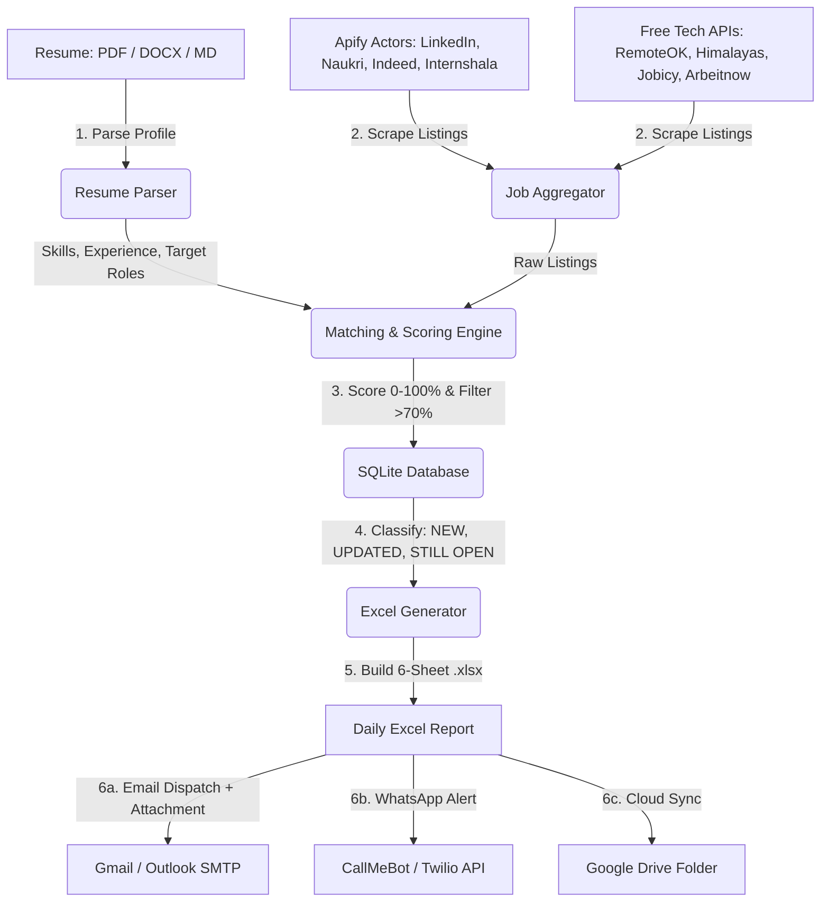

# 🚀 DAILY AI JOB HUNTING AGENT — COMPLETE WORKFLOW SPECIFICATION

This document outlines the architecture, data pipeline, scheduling, and configuration for your self-hosted **Daily AI Job Hunting Agent**. It eliminates the need for Claude Cowork / paid subscriptions by running as an autonomous Python engine locally or 100% free in the cloud.

---

## 1. System Architecture & Data Flow



---

## 2. Step-by-Step Execution Lifecycle

### Phase 1: Candidate Profile Extraction (Source of Truth)
- Parses `resume/sample_resume.md` (or your uploaded `resume.pdf`/`docx`).
- Extracts tech stack, core competencies, project keywords, education, and target experience level (Fresher / 0–2 years).
- Caches structured data in `.resume_parsed.json` for token and execution efficiency.

### Phase 2: Multi-Source Job Aggregation
- **Apify Integration**: Connects to targeted actors for LinkedIn, Naukri, Indeed, and Internshala using your free Apify API token ($5 free credit monthly).
- **Free API Fallback**: Queries open remote APIs (RemoteOK, Jobicy, Arbeitnow, Himalayas) ensuring you always receive 20–30 fresh jobs even if Apify credits expire.
- **Normalization**: Maps diverse source formats into a unified schema:
  - `Company`, `Role`, `Location`, `Work Mode`, `Posted Date`, `Salary`, `Experience`, `Job Type`, `Source`, `Apply Link`, `Recruiter LinkedIn`, `Company Website`.

### Phase 3: Resume Matching & Scoring (0–100%)
- **Experience Filter**: Discards roles requiring >3 years or Senior/Lead/Manager titles.
- **Scoring Breakdown**:
  - **40%**: Resume skills overlap (Python, AI/ML, React, SQL, FastAPI, Docker, QA tools, etc.)
  - **25%**: Tech stack & project alignment
  - **15%**: Fresher/Junior/Intern eligibility bonus
  - **10%**: Location priority (India tech hubs or remote)
  - **10%**: Freshness bonus
- Categorizes jobs into:
  - `Software / Development`
  - `AI / ML / GenAI`
  - `Testing / QA`
  - `Analyst / Entry Level`

### Phase 4: SQLite Deduplication & History Tracking
- Maintains `jobs_history.db`.
- Calculates unique hash: `sha256(company|title|url)`.
- Flags status:
  - 🆕 `NEW`: Discovered for the first time today.
  - 🔄 `UPDATED`: Salary/URL or details refreshed.
  - ⏳ `STILL OPEN`: Active listing from previous days.
  - ❌ `EXPIRED`: Closed application.

### Phase 5: 6-Sheet Excel Report Generation
Generates `reports/Daily_Job_Hunt_YYYY-MM-DD.xlsx` containing:
1. **DAILY JOBS**: All qualified jobs sorted by Match % + Freshness with clickable hyperlinks, frozen panes, and status badges.
2. **TOP MATCHES**: Top 5–10 highest-scoring roles to apply for immediately.
3. **REMOTE**: India-eligible remote roles.
4. **AI & GENAI**: AI, ML, GenAI, LLM, RAG, and NLP positions.
5. **INTERNSHIPS**: Internships and Intern-to-FTE opportunities.
6. **TESTING & ANALYST**: QA, Automation Testing, Business Analyst, and Data Analyst roles.

### Phase 6: Multi-Channel Dispatch
Sends the standard daily alert:
```
📅 Daily Job Hunt — 2026-09-03

🆕 New: 18
💻 Software: 12
🤖 AI/ML/GenAI: 08
🧪 Testing/QA: 04
📊 Analyst: 02
🎓 Internships: 05
🌐 Remote: 10

🔥 Best Match: OpenAI Labs — AI Engineer — 95%

📊 Excel Report: Daily_Job_Hunt_2026-09-03.xlsx
```
- **Email**: Formatted HTML digest with `.xlsx` attached.
- **WhatsApp**: Instant mobile notification via CallMeBot (100% free) or Twilio.
- **Google Drive**: Auto-uploads report to your designated Google Drive folder.

---

## 3. Configuration & Setup Guide

### Step 1: Install Dependencies
```powershell
pip install -r requirements.txt
```

### Step 2: Set Environment Variables
Copy `.env.example` to `.env` and fill in your desired channels:
```powershell
Copy-Item .env.example .env
```

#### A. Add Your Resume
Place your resume in `resume/` (e.g. `resume/my_resume.pdf` or edit `resume/sample_resume.md`), and set `RESUME_PATH=resume/my_resume.pdf` in `.env`.

#### B. Free WhatsApp Setup (CallMeBot - 10 Seconds)
1. Add phone number `+34 941 01 99 62` to your phone contacts (CallMeBot).
2. Send message: `I allow callmebot to send me messages` via WhatsApp.
3. CallMeBot will reply with your `apikey`.
4. In `.env`:
   ```env
   WHATSAPP_ENABLED=true
   WHATSAPP_PROVIDER=callmebot
   CALLMEBOT_PHONE=+919876543210
   CALLMEBOT_API_KEY=your_apikey
   ```

#### C. Email Setup (Gmail App Password)
1. In Google Account > Security > 2-Step Verification > **App Passwords**.
2. Generate an app password for "Mail".
3. In `.env`:
   ```env
   EMAIL_ENABLED=true
   EMAIL_SENDER=your_email@gmail.com
   EMAIL_PASSWORD=your_16_char_app_password
   EMAIL_RECIPIENT=your_email@gmail.com
   ```

#### D. Apify Token (Optional for expanded scraping)
1. Sign up at [apify.com](https://apify.com) (Free $5 monthly credit).
2. Copy your API Token from Settings > Integrations > API Tokens.
3. In `.env`: `APIFY_API_TOKEN=apify_api_...`

---

## 4. How to Run & Automate

### Option A: Manual Test Run
```powershell
# Run once and send notifications
python main.py --run-now

# Dry run (test scraping and generate Excel without sending messages)
python main.py --dry-run
```

### Option B: Local Windows Automation (Runs Every Morning)
Run the included PowerShell installer once:
```powershell
powershell -ExecutionPolicy Bypass -File .\setup_windows_task.ps1
```

### Option C: 100% Free 24/7 Cloud Automation (GitHub Actions)
You don't even need to leave your computer running!
1. Push this folder to a **Private GitHub repository**.
2. Go to **Settings > Secrets and variables > Actions** in GitHub.
3. Add your secrets (`EMAIL_SENDER`, `EMAIL_PASSWORD`, `APIFY_API_TOKEN`, etc.).
4. The GitHub Action `.github/workflows/daily_job_hunt.yml` will run automatically every morning at 08:00 AM IST (02:30 UTC), generating your Excel sheet and sending your WhatsApp/Email reports.
