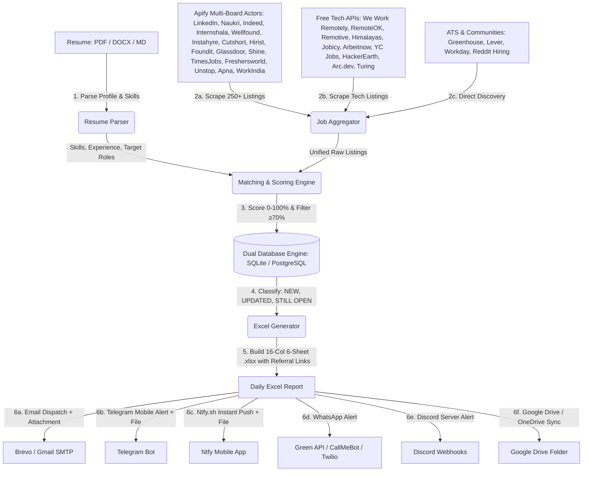

# 🚀 DAILY AI JOB HUNTING AGENT — COMPLETE WORKFLOW SPECIFICATION

This document outlines the architecture, multi-board data pipeline, candidate scoring engine, scheduling, and configuration for your self-hosted **Daily AI Job Hunting Agent**. It eliminates the need for paid subscription tools by running as an autonomous Python engine locally or 100% free in the cloud.

---

## 1. System Architecture & Data Flow



---

## 2. Step-by-Step Execution Lifecycle

### Phase 1: Candidate Profile Extraction (Source of Truth)
- Parses your candidate resume from `resume/` (`.pdf`, `.docx`, `.txt`, or `.md`).
- Extracts tech stack, core competencies, project keywords, education, and target experience level (*Fresher / 0–2 years*).
- Caches structured data in `resume/.*_parsed.json` for token and execution efficiency.

### Phase 2: Multi-Source Comprehensive Job Aggregation
- **Apify Multi-Board Search Engine**:
  - Connects to Apify actors (`misceres~indeed-scraper`, `apify~google-search-scraper`) querying **27+ platforms**:
    - **Indian Job Boards**: LinkedIn Jobs, Naukri, Indeed India, Internshala, Wellfound, Instahyre, Cutshort, Hirist, Foundit, Glassdoor, Shine, TimesJobs, Freshersworld, Unstop, Apna, WorkIndia.
    - **Tech / Startup / Remote**: YC Jobs (WorkAtAStartup), HackerEarth, Arc.dev, Turing, We Work Remotely, RemoteOK, Remotive, Himalayas, Jobicy, Arbeitnow.
    - **ATS & Communities**: Greenhouse, Lever, Workday, Reddit Hiring (`r/forhire`, `r/jobbit`).
- **Free Open Tech APIs**: Direct queries to WeWorkRemotely RSS, RemoteOK, Remotive, Himalayas, and Jobicy endpoints ensuring high job volume even with zero credits.
- **Unified Normalization**: Maps diverse source formats into a standardized dictionary:
  - `Company`, `Role`, `Location`, `Work Mode`, `Posted Date`, `Salary`, `Experience`, `Job Type`, `Source`, `Apply Link`, `Recruiter LinkedIn`, `Company Website`, `Description`.

### Phase 3: Resume Matching & Smart Scoring (0–100%)
- **Experience Filter**: Discards roles requiring >3 years or Senior/Lead/Manager titles.
- **Scoring Breakdown**:
  - **40%**: Technical skill keyword overlap (Python, AI/ML, React, Next.js, SQL, FastAPI, Docker, LangChain, RAG, etc.).
  - **25%**: Tech stack & project alignment.
  - **15%**: Fresher/Junior/Intern eligibility bonus.
  - **10%**: Location priority (Bengaluru & Remote).
  - **10%**: Freshness bonus.
- **Category Classification**:
  - `Software / Development`
  - `AI / ML / GenAI`
  - `Testing / QA`
  - `Analyst / Entry Level`

### Phase 4: Dual Database Deduplication & History Tracking
- **Dual-Engine Support**: Supports zero-config local SQLite (`jobs_history.db`) or Cloud PostgreSQL / Supabase via `DATABASE_URL`.
- **SHA-256 Deduplication**: Calculates unique hash `sha256(company|title|url)`.
- **Status Badging**:
  - 🆕 `NEW`: Discovered for the first time today.
  - 🔄 `UPDATED`: Salary/URL or details refreshed.
  - ⏳ `STILL OPEN`: Active listing from previous days.
  - ❌ `EXPIRED`: Closed application.

### Phase 5: Professional 6-Sheet Excel Report with Referral Search
Generates `reports/Daily_Job_Hunt_YYYY-MM-DD.xlsx` containing 16 formatted columns:
1. **`#`** — Sequence index
2. **`Company`** — Hiring organization
3. **`Role`** — Job title
4. **`Location`** — Target city or region
5. **`Work Mode`** — Remote, Hybrid, or On-site
6. **`Posted`** — Verified date
7. **`Match %`** — Highlighted green (≥85%) or yellow (≥70%)
8. **`Experience`** — Required experience range
9. **`Salary`** — Compensation (if disclosed)
10. **`Job Type`** — Full-time, Internship, or Contract
11. **`Source`** — Board origin (*Naukri, LinkedIn, Indeed, etc.*)
12. **`Apply Link`** — Clickable application hyperlink (`Apply Link ↗`)
13. **`Find Referral (LinkedIn)`** — **NEW**: Direct pre-filtered employee search link (`Ask Referral ↗`) to connect with company engineers on LinkedIn.
14. **`Recruiter LinkedIn`** — Recruiter profile link (if available)
15. **`Company Website`** — Official website link
16. **`Status`** — `🆕 NEW`, `🔄 UPDATED`, `⏳ STILL OPEN`

**Specialized Sheets**:
* **Sheet 1: DAILY JOBS** — All top matching opportunities.
* **Sheet 2: TOP MATCHES** — Top 10 highest-ranked opportunities for immediate application.
* **Sheet 3: REMOTE** — Verified India-eligible remote roles.
* **Sheet 4: AI & GENAI** — AI, ML, GenAI, LangChain, RAG, and NLP roles.
* **Sheet 5: INTERNSHIPS** — Graduate Trainee and Internship roles.
* **Sheet 6: TESTING & ANALYST** — QA Automation and Data/BI Analyst roles.

### Phase 6: Multi-Channel Delivery & Cloud Sync
Dispatches the formatted summary:
```
📅 Daily Job Hunt — 2026-09-03

🆕 New: 23
💻 Software: 38
🤖 AI/ML/GenAI: 11
🧪 Testing/QA: 01
📊 Analyst: 00
🎓 Internships: 11
🌐 Remote: 38

🔥 Best Match: Cuculus GmbH — Junior Python Developer — 99.0%

📊 Excel Report: Daily_Job_Hunt_2026-09-03.xlsx
```
- **✉️ Email (Brevo / Gmail SMTP)**: HTML digest with `.xlsx` attachment.
- **✈️ Telegram Bot**: Instant message + attached downloadable Excel file.
- **🔔 Ntfy.sh**: Free, private, open-source push notification + Excel download on your mobile phone.
- **📱 WhatsApp**: Green-API / pywhatkit delivery.
- **☁️ Google Drive / OneDrive Sync**: Uploads to Google Drive or syncs to local cloud folders.

---

## 3. Configuration Guide (`.env`)

```env
# 1. CANDIDATE RESUME
RESUME_PATH=resume/Srinivas_A_Resume.pdf

# 2. APIFY SCRAPER (For LinkedIn, Naukri, Indeed, Internshala, Wellfound, etc.)
APIFY_API_TOKEN=your_apify_token

# 3. EMAIL NOTIFIER (Brevo SMTP or Gmail App Password)
EMAIL_ENABLED=true
SMTP_SERVER=smtp-relay.brevo.com:587
SMTP_USER=your_smtp_user
SMTP_PASSWORD=your_smtp_password
EMAIL_SENDER=your_email@gmail.com
EMAIL_RECIPIENT=your_email@gmail.com

# 4. MOBILE NOTIFIERS (Telegram / Ntfy)
TELEGRAM_ENABLED=false
TELEGRAM_BOT_TOKEN=
TELEGRAM_CHAT_ID=

NTFY_ENABLED=false
NTFY_TOPIC=my_daily_job_alerts

# 5. GOOGLE DRIVE / ONEDRIVE SYNC
GDRIVE_ENABLED=true
GDRIVE_LOCAL_PATH=C:\Users\anand\OneDrive\Documents\Daily_Job_Reports
GDRIVE_FOLDER_ID=your_google_drive_folder_id

# 6. PIPELINE SETTINGS
DAILY_RUN_TIME=08:00
TARGET_DAILY_JOBS=50
MIN_MATCH_SCORE=70
```

---

## 4. Daily Automation Options

### Option A: Local Windows Task Scheduler (08:00 AM Daily)
```powershell
powershell -ExecutionPolicy Bypass -File .\setup_windows_task.ps1
```

### Option B: 24/7 Cloud Automation (GitHub Actions)
The included `.github/workflows/daily_job_hunt.yml` runs every morning at **08:00 AM IST (02:30 UTC)** in the cloud with zero PC uptime needed.

---

## 5. Security & Safety Hardening
* **Spreadsheet Formula Injection Defense (CWE-1236)**: Escapes formula triggers (`=`, `+`, `-`, `@`, `\t`, `\r`) in company names and job descriptions.
* **URL Scheme Validation**: Strictly permits `http://` and `https://` protocols for hyperlinks.
* **Secret Protection**: `.gitignore` strictly protects `.env`, database files, `.xlsx` reports, and personal PDF resumes from ever being committed to GitHub.
